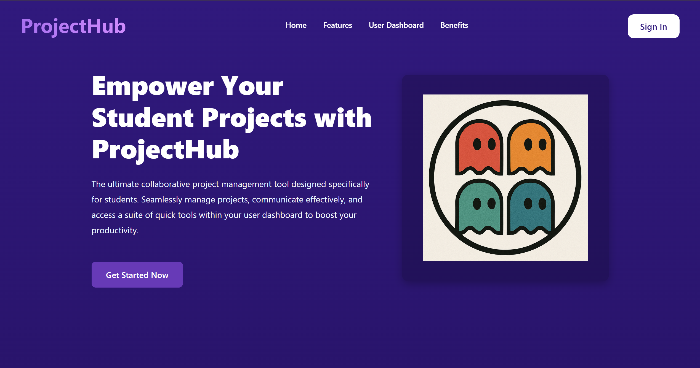
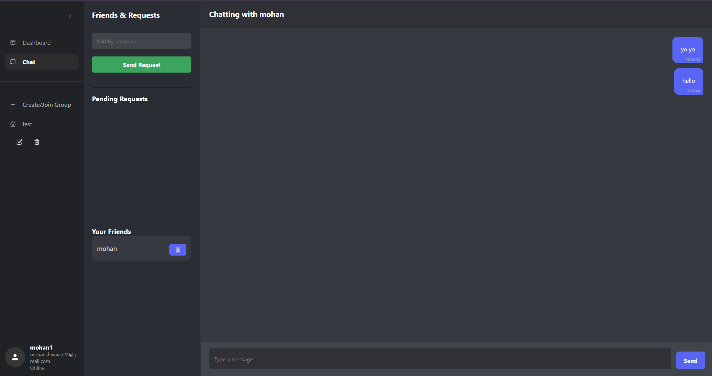

# Collaborative Project Management Tool for Students

## Real-Time Collaborative Academic Project Management Platform

<p align="left">


</p>

*A centralized platform designed to streamline academic teamwork through
structured task management, real-time communication, and project
analytics.*

------------------------------------------------------------------------

## Repository

https://github.com/mohanchandrass/Collaborative-Project-Management-Tool-for-Students

------------------------------------------------------------------------

## Team Members

-   Mohan Chandra S S
-   Prabhat M
-   Likith S G
-   Nithin S
-   Karthik S M

------------------------------------------------------------------------

## Application Demo

### Application Walkthrough

<p align="center">
  
</p>

### Key Screens

#### ProjectHub/Teamly an APP for Project Management
<p align="center">
  
</p>

#### Dashboard with Quick Access
<p align="center">
  
</p>

#### Chat with Your Friends/Teammates
<p align="center">
  
</p>

------------------------------------------------------------------------

## Overview

Academic teams frequently struggle with fragmented communication,
unclear task ownership, and limited progress visibility. This platform
consolidates project operations into a single environment, enabling
structured collaboration and improving execution efficiency.

The system focuses on:

-   Transparent task tracking
-   Integrated communication
-   Real-time updates
-   Simplified project governance

------------------------------------------------------------------------

## Core Features

### Task Management

Create, assign, and monitor tasks with defined ownership and deadlines
to maintain accountability across teams.

### Project Dashboard

Access a consolidated view of project status, timelines, and workload
distribution.

### Real-Time Group Chat

Facilitate seamless team communication without external messaging tools.

### Notifications

Receive alerts for deadlines, task modifications, and project activity.

### Project Analytics

Leverage visual indicators to evaluate progress and quickly identify
blockers.

------------------------------------------------------------------------

## Technology Stack

**Frontend** - React
- Redux
- Material UI

**Backend** - Firebase Firestore
- Firebase Authentication

**Real-Time Infrastructure** - Firebase Realtime Database

**Hosting** - Firebase Hosting

**Version Control** - GitHub

------------------------------------------------------------------------

## Getting Started

### Prerequisites

-   Node.js (v14 or higher)
-   npm or yarn

### Clone the Repository

``` bash
git clone https://github.com/mohanchandrass/Collaborative-Project-Management-Tool-for-Students.git
cd Collaborative-Project-Management-Tool-for-Students
```

### Install Dependencies

``` bash
npm install
```

or

``` bash
yarn install
```

### Firebase Setup

1.  Create a Firebase project.
2.  Enable Email/Password authentication.
3.  Configure Firestore.
4.  Add the Firebase configuration to the application.

### Run Locally

``` bash
npm start
```

Application runs at:

    http://localhost:3000

------------------------------------------------------------------------

## Typical Workflow

1.  Create a project.
2.  Add team members.
3.  Break work into tasks.
4.  Assign responsibilities.
5.  Communicate via group chat.
6.  Track progress from the dashboard.

------------------------------------------------------------------------

## Contributing

1.  Fork the repository
2.  Create a feature branch
3.  Commit your changes
4.  Push to your branch
5.  Open a Pull Request

------------------------------------------------------------------------

## Roadmap

-   Role-based access control
-   Third-party integrations
-   Advanced analytics
-   Improved mobile responsiveness
-   Offline capability exploration

------------------------------------------------------------------------

## License

MIT License. Refer to the LICENSE file for details.

------------------------------------------------------------------------

## Contact

GitHub: https://github.com/mohanchandrass

For issues or collaboration inquiries, open a repository issue.
